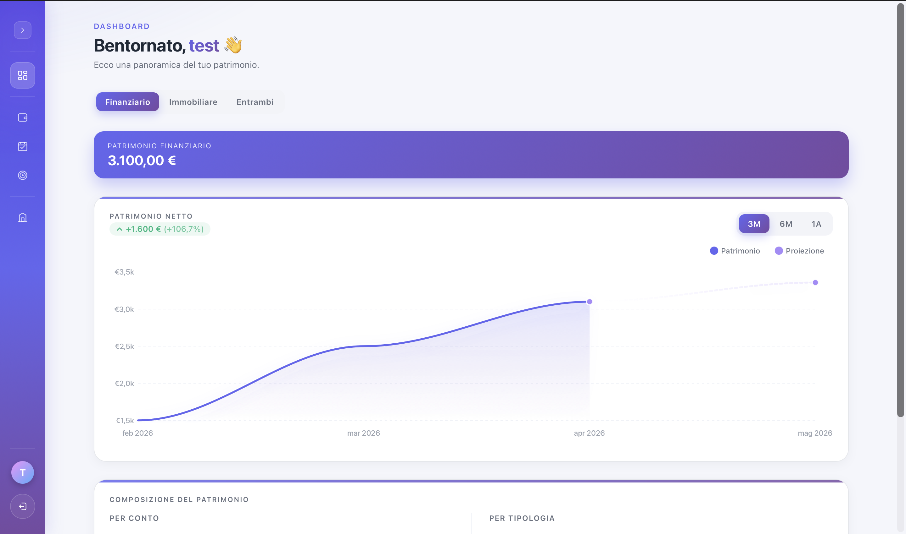
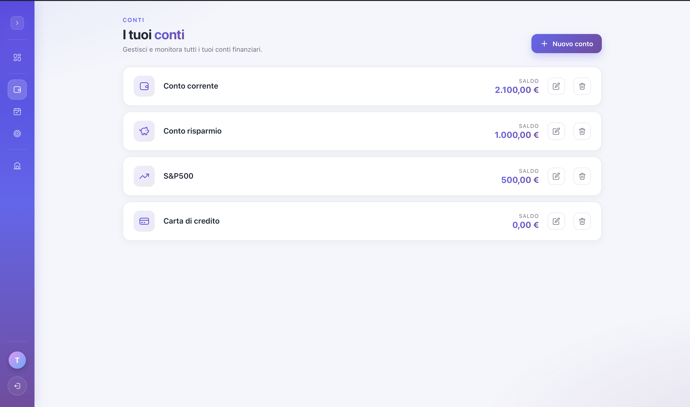
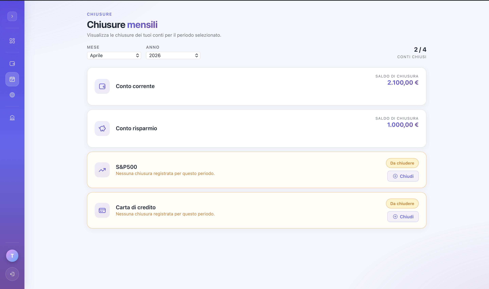
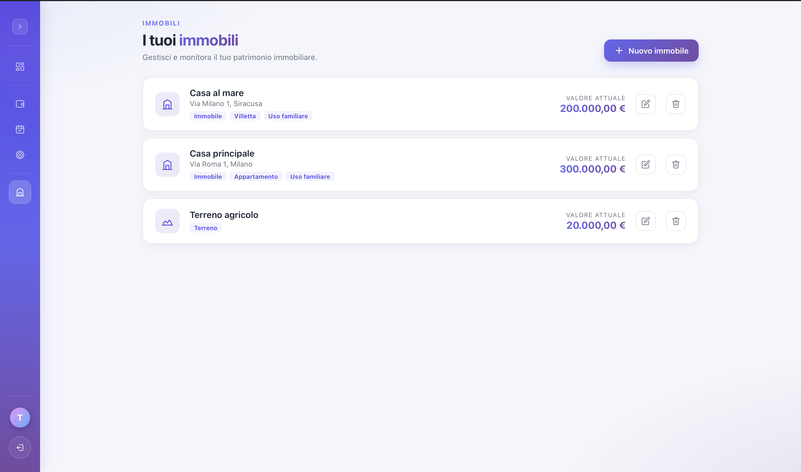
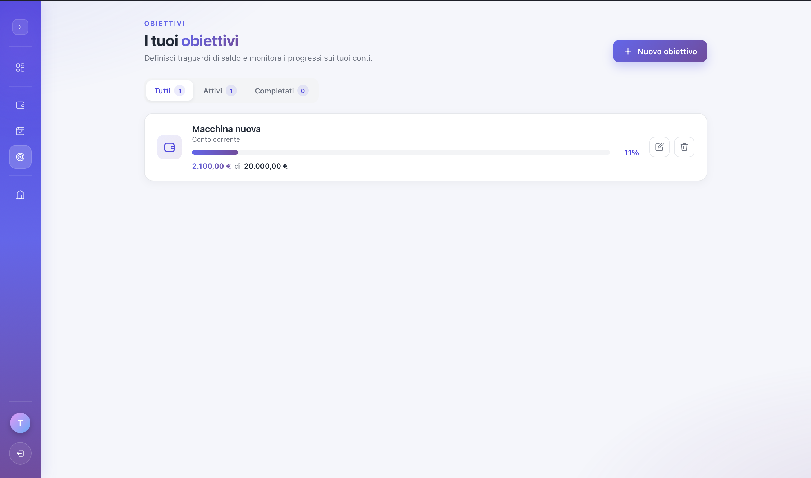
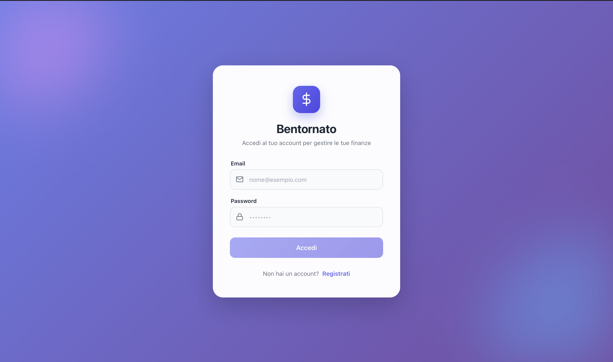

# Personal Finance Tracker


> Track bank accounts, monthly balance snapshots, real-estate properties and net-worth projections — all in one self-hosted app.

[](LICENSE)
[](https://nestjs.com/)
[](https://angular.io/)
[](https://www.prisma.io/)
[](https://www.sqlite.org/)
[](https://www.docker.com/)
[](https://www.typescriptlang.org/)

<!--
SCREENSHOT PLACEHOLDER — HERO
File: docs/screenshots/home.png
What to capture: home dashboard logged in as demo user, showing the net-worth chart with full 12-month history + KPI cards (current net worth, projection, etc.). 1440x900, light theme.
-->


---

## Features

- **JWT authentication** with access + refresh token rotation
- **Multiple accounts** per user — `checking`, `saving`, `investment`, `debit` (liability, subtracted from net worth)
- **Monthly closures** — one balance snapshot per account per month, enforced at DB level
- **Savings goals** attached to accounts, with target amount and completion tracking
- **Real-estate properties** (buildings, land) tracked separately from bank accounts
- **Net-worth analytics** over trimestral / semestral / yearly windows
- **Net-worth projection** for the next month based on 12-month trend
- **Italian locale** (`it-IT`), EUR currency

## Tech stack

**Backend** — NestJS 11 · Prisma 5 · SQLite · Passport JWT · class-validator · Jest

**Frontend** — Angular 16 · ApexCharts (`ng-apexcharts`) · RxJS · lazy-loaded feature modules

**Infra** — Docker Compose for the full stack · Prisma migrations · custom Prisma client output path

## Screenshots

<!--
SCREENSHOT PLACEHOLDERS — GALLERY
Save each PNG in docs/screenshots/ with the exact filename listed below.
Suggested viewport: 1440x900. Use the demo user so data looks meaningful but not personal.
-->

| | |
|---|---|
| **Accounts** — list of bank accounts with type, balance and current totals. <br>`docs/screenshots/accounts.png` | **Closures** — monthly balance history for a single account, ideally with the chart visible. <br>`docs/screenshots/closures.png` |
|  |  |
| **Properties** — real-estate holdings page with cards/list of properties. <br>`docs/screenshots/properties.png` | **Goals** — savings goals attached to an account, with progress. <br>`docs/screenshots/goals.png` |
|  |  |
| **Login** — auth page (logout first to capture it clean). <br>`docs/screenshots/login.png` | |
|  | |

## Architecture

```
┌──────────────────────────┐         ┌──────────────────────────┐
│   Angular 16 webapp      │  HTTPS  │   NestJS 11 API          │
│   (lazy feature modules) │ ──────► │   (JWT-guarded routes)   │
│   ApexCharts dashboards  │         │   Repository pattern     │
└──────────────────────────┘         └────────────┬─────────────┘
                                                  │ Prisma
                                                  ▼
                                          ┌───────────────┐
                                          │   SQLite DB   │
                                          └───────────────┘
```

The API follows a layered NestJS module structure, repeated for every feature:

```
module/
  *.module.ts          wires providers + imports
  *.controller.ts      HTTP endpoints
  *.service.ts         business logic
  *.repository.ts      Prisma queries (implements I*Repository)
  dto/                 class-validator input shapes
  presenter/           output shaping
```

Feature modules: **auth**, **account**, **closure**, **analytic**, **goal**, **property** (+ shared **prisma** module).

**Repository DI uses string tokens, not interfaces directly.** Each module exports a token constant (e.g. `ACCOUNT_REPOSITORY = "IAccountRepository"`); services inject via `@Inject(ACCOUNT_REPOSITORY) repo: IAccountRepository`, and tests can drop in a `jest-mock-extended` mock of the interface. This keeps services decoupled from Prisma and trivially testable.

Global `ValidationPipe` is registered with `whitelist`, `forbidNonWhitelisted`, `transform` — request bodies are stripped to declared DTO properties and rejected outright if they contain unknown keys.

## Getting started

### Option A — Docker (recommended)

```bash
docker compose -f docker-compose.dev.yml up
```

- API on http://localhost:3000
- Webapp on http://localhost:80
- SQLite persisted at `api/prisma/dev.db`

### Option B — Native

**API:**
```bash
cd api
cp .env.example .env
# fill in JWT_SECRET and JWT_REFRESH_SECRET (use: openssl rand -hex 64)
npm install
npx prisma generate
npx prisma migrate dev
npm run start:dev          # http://localhost:3000
```

**Webapp:** (in a separate terminal)
```bash
cd webapp
npm install
npm start                  # http://localhost:4200
```

## Environment variables

API — see `api/.env.example`.

| Variable | Example | Description |
|---|---|---|
| `DATABASE_URL` | `file:./dev.db` | Prisma SQLite connection string |
| `JWT_SECRET` | _strong random_ | Signing secret for access tokens |
| `JWT_ACCESS_EXPIRES_IN` | `15m` | Access token lifetime |
| `JWT_REFRESH_SECRET` | _strong random_ | Signing secret for refresh tokens |
| `JWT_REFRESH_EXPIRES_IN` | `7d` | Refresh token lifetime |

Generate strong secrets with `openssl rand -hex 64`. The app will fail to start if any are missing (no insecure fallbacks).

## Project structure

```
personal-finance/
├── api/                          NestJS backend
│   ├── src/
│   │   ├── auth/                 JWT auth + refresh token rotation
│   │   ├── account/              bank account CRUD
│   │   ├── closure/              monthly balance snapshots
│   │   ├── analytic/             net-worth history + projection
│   │   ├── goal/                 savings goals per account
│   │   ├── property/             real-estate properties
│   │   └── prisma/               shared Prisma client
│   ├── test/                     Jest test suites
│   ├── prisma/schema.prisma      DB schema (SQLite)
│   └── generated/prisma/         custom client output path
├── webapp/                       Angular frontend
│   └── src/app/
│       ├── auth/                 login + register
│       ├── home/                 dashboard with charts
│       ├── accounts/             accounts feature
│       ├── closures/             monthly closures feature
│       ├── goals/                goals feature
│       ├── properties/           properties feature
│       ├── core/                 services, interceptors, guards
│       ├── shared/               shared components/pipes
│       └── layout/               main app shell
├── docs/screenshots/             README images
├── docker-compose.dev.yml        full-stack dev environment
└── README.md
```

## Domain concepts

- **Closure** — a monthly balance snapshot for one account. Creating a closure for month _M/Y_ records the balance at the end of that period. Unique on `(accountId, year, month)`.
- **Net worth** — sum of all account balances, with `debit` accounts subtracted. Computed purely from closures; properties have a separate summary endpoint.
- **Net-worth projection** — takes the last 12 months of net-worth, computes `(last − first) / numPeriods` as average monthly change, and adds that once to the last period to project the next month. Not a true regression — intentionally simple.
- **Analytic periods** — `TRIMESTRAL` (3m), `SEMESTRAL` (6m), `YEARLY` (12m).
- **Goal** — a `targetAmount` attached to an account, marked done by setting `completedAt`.
- **Property** — a real-asset holding (building, land, etc.) owned by the user directly, independent of accounts.

## Development

```bash
# API
cd api
npm run test            # Jest unit tests
npm run test:cov        # with coverage
npm run test:e2e        # end-to-end
npm run lint            # ESLint + auto-fix
npx prisma studio       # browse the DB
npx prisma migrate dev  # apply migrations

# Webapp
cd webapp
npm test                # Karma + Jasmine
npm run build           # production build
```

## License

[MIT](LICENSE) © Stefano Bellio
